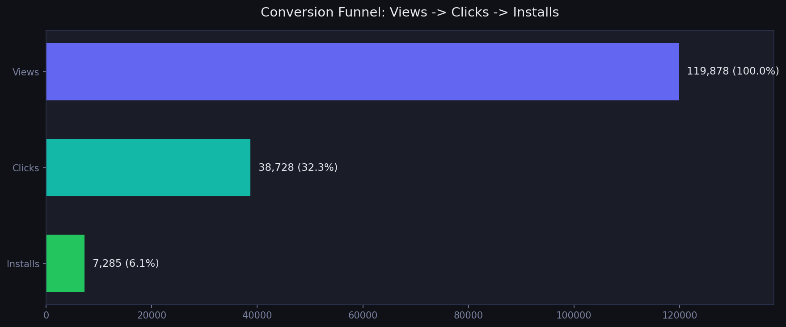
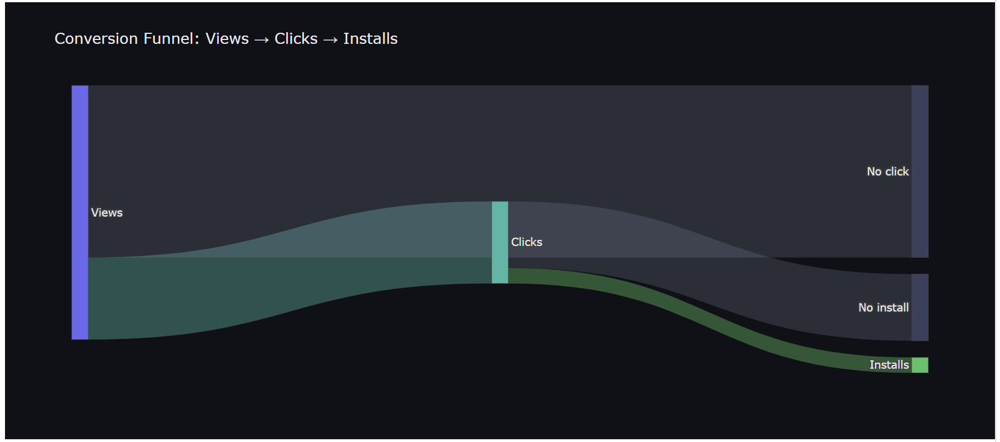
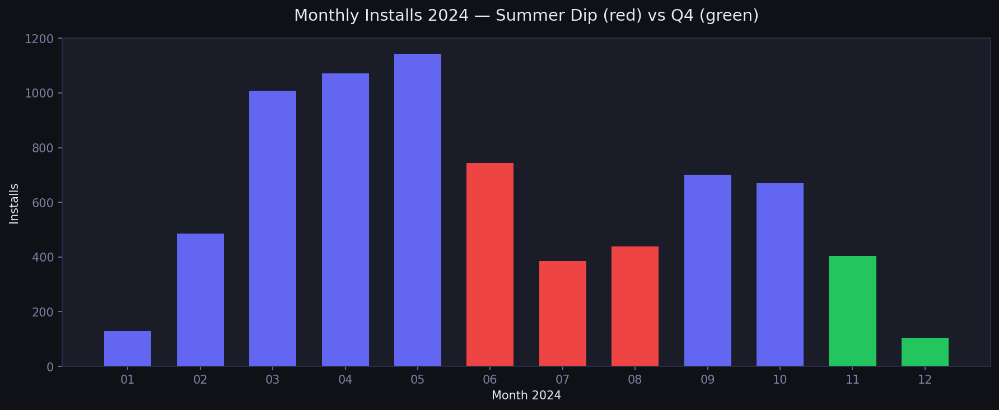
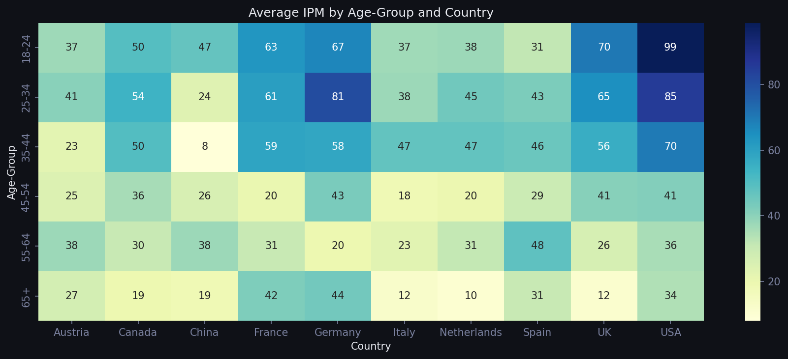

# Ad-Tech Campaign Performance & A/B Testing Analysis
### Business Analyst Portfolio Project | Nasim Maleki

[](https://python.org)
[]()
[]()
[]()

---

## Business Context

An ad-tech company ran 40 user-acquisition campaigns across 10 markets in 2024. As Business Analyst, the task was to evaluate campaign performance over the full year and provide data-driven recommendations to improve ad spend efficiency, while also answering whether a new ad format should replace the existing one.

This project deliberately follows a **complete business-analyst workflow** — business framing, stakeholder mapping, requirements, data governance, analysis, statistical testing, and quantified recommendations — not just exploratory data analysis.

The project is split into two sections:

1. **Campaign Performance Analysis** — SQL and Python to evaluate which campaigns and user segments deliver the best return, plus budget utilisation, funnel, and seasonality.
2. **A/B Testing** — whether a new ad format should replace the existing one, using a sampling-validity check, a two-proportion z-test, and a power analysis.

---

## The Business-Analyst Workflow

| # | Section | BA Category |
|---|---------|-------------|
| 1 | Business Problem & Project Brief | Business Context |
| 2 | Stakeholder Analysis | Stakeholder Analysis |
| 3 | Requirements & Business Questions | Requirements Analysis |
| 4 | Data Requirements & Data Dictionary | Data Requirements |
| 5 | Business Rules & KPI Definitions | Business Rules |
| 6 | Data Quality Assessment & Cleaning | Data Quality & Governance |
| 7 | Campaign Performance Analysis (SQL) | Analysis & Insight |
| 8 | Conversion Funnel Analysis | Analysis & Insight |
| 9 | Segment Performance Analysis (IPM) | Analysis & Insight |
| 10 | Time Trends & Seasonality | Analysis & Insight |
| 11 | A/B Test — Sampling & Validity Check | Experimentation |
| 12 | A/B Test — Significance & Power Analysis | Experimentation |
| 13 | Recommendations & Decision Memo | Recommendations |
| 14 | Executive Summary & Conclusion | Communication |

---

## Dataset

The data models a full ad-tech funnel — views, clicks, and installs across 40 campaigns and 3,000 users over 2024.

| Table | Grain (one row =) | Description |
|-------|-------------------|-------------|
| Campaigns | one campaign | Budget, cost per install, category, start/end dates |
| CampaignViews | one ad view | View events with timestamp and user |
| CampaignClicks | one ad click | Click events with timestamp and user |
| CampaignInstalls | one app install | Install events with timestamp and user |
| Users | one user | Demographics — age group, gender, country |
| Control / Target Group | one A/B user | Format, age, country, ARPU |

> **Data note:** the dataset is **synthetic**, generated to mirror the structure of a real assignment without using proprietary data. The generator script (`generate_adtech_data.py`) is included. It produces a full year of 2024 data with realistic funnel drop-off, seasonality, and deliberately injected data-quality issues.

---

## Section 1 — Campaign Performance Analysis

### Business Questions
- Which campaigns performed best, and how efficiently was budget spent?
- How much of each campaign's allocated budget was actually used?
- Where in the Views → Clicks → Installs journey do we lose the most users?
- Which user segments (age, gender, country) drive the best results?
- Is there seasonality across the year?

### Approach
Data was loaded into Python and structured into SQLite tables. Performance was analysed using SQL queries with **CTEs** to aggregate views, clicks, installs, spend, and budget utilisation per campaign. Custom KPIs enabled fair comparison:

- **Cost Per Install (CPI)** — spend ÷ installs
- **Budget Utilisation** — spend ÷ allocated budget
- **IPM (Installs Per Mille)** — installs per 1,000 views, by segment

### Key Findings

**Budget is massively under-utilised.** Across all 40 campaigns, only **EUR 142,075 of the EUR 433,000 allocated budget was actually spent — 32.8%.** Of 40 campaigns, **29 spent less than half their budget**, while one campaign overspent to 193%. This is the single biggest finding: the company is leaving installs on the table while budget sits idle.

**Campaign efficiency varies clearly.** Ranking by cost per install revealed distinct tiers:
- **Most efficient** (lowest CPI): Campaign 13, Campaign 4, Campaign 22 — candidates for budget increase
- **Least efficient** (highest CPI): Campaign 14, Campaign 29, Campaign 10 — candidates for reduction or pause

**The funnel loses most users at the first step.** Views → Clicks → Installs:
- 119,878 views → 38,728 clicks (32.3%) → 7,285 installs (18.8% of clicks)
- Overall view-to-install conversion: **6.08%**
- The largest absolute drop is **View → Click (81,150 users lost)** — the highest-leverage place to improve

**Segment performance is geographically concentrated.** IPM analysis showed:
- Highest IPM in the **USA and Germany**, particularly in the **18–44 age range**
- Lowest IPM in **Italy and Austria**
- **No meaningful difference between male and female** users
- The single strongest segment: **users aged 18–24 in the USA**

**Performance is seasonal.** Install rate falls from **~23% in spring (Mar–May) to ~13% in summer (Jun–Aug)** — summer traffic converts worse, not just lower volume. Budget concentrated in summer works harder for less return.

### Visualizations

**Conversion Funnel**


**Funnel Flow (Sankey)**


**Monthly Installs — Seasonality**


**IPM Heatmap — Age Group vs Country**


---

## Section 2 — A/B Testing

### Objective
Evaluate whether a new ad format should replace the current format, by comparing click-through behaviour between a control group (old format) and a target group (new format).

### Part 1 — Sampling Representativeness Check

Before evaluating results, the validity of the 20/80 sampling split was assessed:

- **No user overlap** between groups — confirms clean separation
- **Gender distribution** imbalanced (chi-square p = 0.18) — but Section 1 showed gender has no effect on conversion, so this is low-risk
- **Country distribution** uneven — some markets appear in only one group
- **ARPU** higher in the target group (21.30 vs 19.46) — a potential confounder
- **Age distribution** balanced (43.6 vs 44.0) — no concern

**Conclusion:** A 20/80 split is acceptable from a risk standpoint, but the sampling is not fully representative. ARPU and country imbalances mean results should be read cautiously.

### Part 2 — Statistical Significance Testing

| Group | Format | Impressions | Clicks | CTR |
|-------|--------|-------------|--------|-----|
| Control | Old | 4,000 | 500 | 12.5% |
| Target | New | 1,000 | 140 | 14.0% |

A **two-proportion z-test** assessed whether the 1.5 percentage point CTR difference was significant.

**Result:** z = −1.27, p = 0.204. Since p > 0.05, the difference is **not statistically significant** — the 1.5pp lift cannot be distinguished from random chance.

### Part 3 — Power Analysis

A power analysis at 80% power and 5% significance quantified how much data a reliable conclusion would need.

**Result:** approximately **8,013 impressions per group** are required to detect a 1.5pp lift. The actual test used only 1,000 in the target group — roughly **8× too few**. The experiment was underpowered.

### Final Recommendation

The new ad format shows early promise but the test **cannot support a confident decision to switch**. The company should extend the experiment until each group reaches ~8,000 impressions. If the 1.5pp lift persists at that scale, the switch would be statistically justified.

---

## Recommendations Summary

1. **Deploy unused budget** into proven-efficient campaigns (only 32.8% of budget spent)
2. **Cap the overspending campaign** running at 193% of budget
3. **Concentrate targeting** on 18–44 in USA and Germany
4. **Drop gender-based targeting** — no effect on conversion
5. **Shift budget away from the summer trough** (23% → 13% install rate)
6. **Improve the View → Click stage** — the funnel's biggest drop-off
7. **Do not switch ad format** until the A/B test reaches ~8,000 impressions per group

---

## Technologies Used

| Tool | Purpose |
|------|---------|
| Python (Pandas, NumPy) | Data loading, cleaning, KPI calculation |
| SQL (SQLite) | Campaign aggregation using CTEs and multi-table joins |
| Matplotlib, Seaborn, Plotly | Visualization — heatmaps, bar charts, Sankey funnel |
| SciPy, Statsmodels | Chi-square test, two-proportion z-test, power analysis |

---

## Repository Structure

```
adtech-campaign-analysis/
│
├── README.md
├── generate_adtech_data.py          # Synthetic data generator
├── adtech_analysis.ipynb            # Full 14-section analysis notebook
│
├── data/
│   ├── campaigns.csv
│   ├── campaign_views.csv
│   ├── campaign_clicks.csv
│   ├── campaign_installs.csv
│   ├── users.csv
│   ├── ab_control.csv
│   └── ab_target.csv
│
└── charts/
    ├── funnel.png
    ├── funnel_sankey.png
    ├── seasonality.png
    └── segment_heatmap.png
```

---

## Key Takeaway

This project demonstrates the full workflow expected of a Business Analyst: framing a business problem, mapping stakeholders, defining requirements and metrics, governing data quality, analysing performance with SQL, and — critically — applying rigorous statistical testing to separate real effects from noise before making quantified, decision-ready recommendations.

---

*Nasim Maleki · Business Analyst · Bremen, Germany*
*[LinkedIn](https://linkedin.com/in/nasim-maaleki) · nasimmaleki.official@gmail.com*
